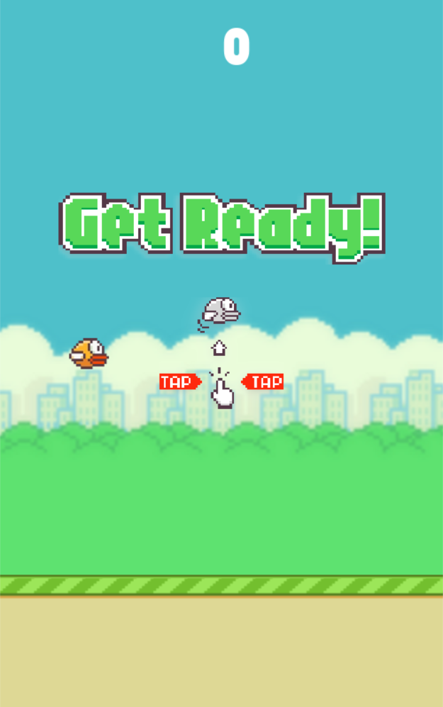

# Flappy Bird Game Clone
This project is a Python-based recreation of the infamous Flappy Bird game. It uses the pygame library for graphics, animations, and game logic, providing a fun and interactive gaming experience.

# Features
- Pixel-perfect Flappy Bird gameplay: Smooth graphics and intuitive controls.
- Scrolling background and ground: Seamlessly scrolling visuals.
- Pipes with gaps: Randomly positioned pipes with challenging gaps.
- Score tracking: Tracks the player's current and high scores.
- Game states: Handles flying, game over, and restart functionalities.
- Custom assets: Includes background, bird, ground, and game-over images.

# How to Play
- Run the code and game will start (make sure you have pygame installed).
- Click anywhere on the screen to start the game.
- Click the mouse button to make the bird flap and avoid pipes.
- The game ends when the bird collides with a pipe, touches the ground, or flies off the top of the screen.
- Click on the restart button to try again.

## Issues

There are still a few minor issues with the game that I am actively working to resolve:
- Pipes at the right edge of the screen remain visible through the ground after the game ends.
- Clicking after the game ends briefly displays the start screen.
- The bird still reacts to clicks and flaps even after the game has ended.
